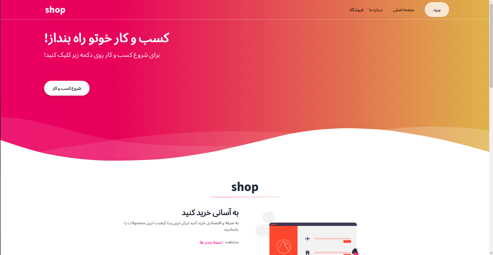
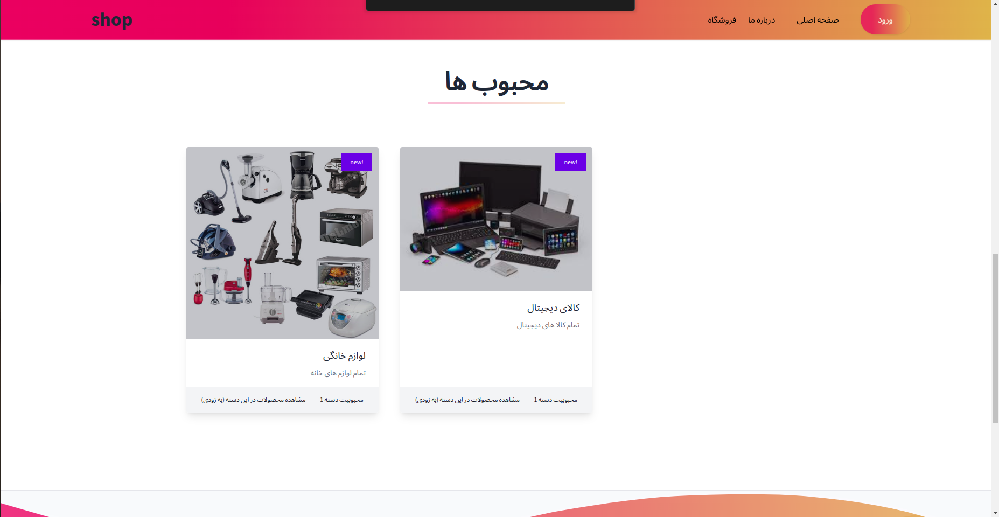
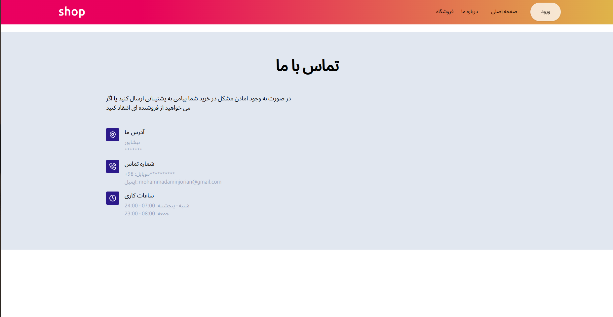
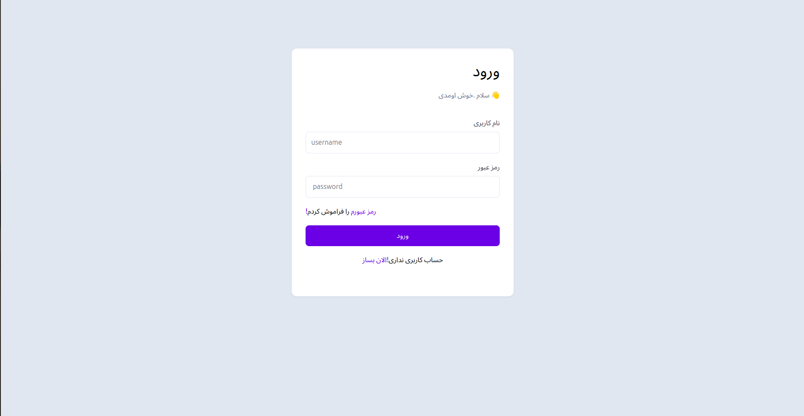
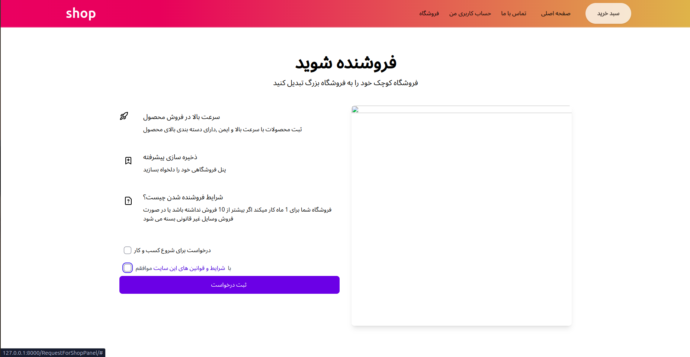
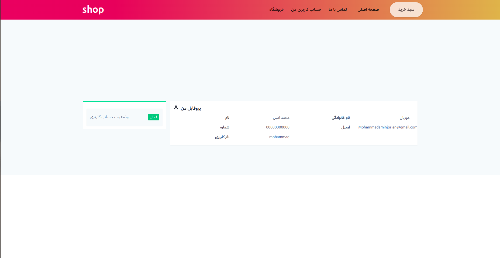
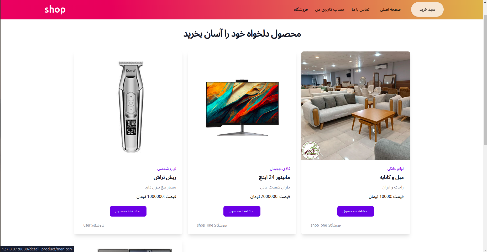
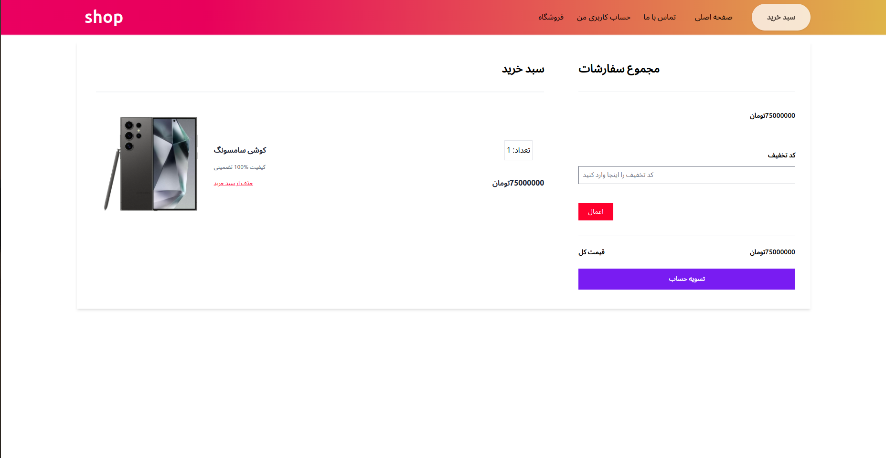

# Advanced store website

Advanced store website and store registration for selling products

## How to run

1. Install python3, pip, virtualenv in your system.
2. Clone the project https://github.com/MohammadAminJorian/shop_level3.
3. Make development environment ready and run project using commands below;
git clone https://github.com/MohammadAminJorian/shop_level3 && cd shop_level3
python venv  env  # Create virtualenv named env
source env/bin/activate
pip install -r requirements.txt
mv  sell_course/settings.py shop_level3/settings.py
python manage.py migrate  # Create database tables  
python manage.py runserver
 

## Features of the website

1. Has a beautiful template
2. Has a management panel
3. Having the registration of the forshgah 
4. The ability to customize a part of the website in the management panel 
5. Full responsive pages
5. Has a management panel for each store 
and...

 
 

# وبسایت فروشگاهی پیشرفته

وبسایت فروشگاهی پیشرفته و ثبت فروشگاه برای فروش محصولات

1. را در سیستم خود نصب کنید python3, pip, virtualenv 
2. پروژه را کلون کنید https://github.com/MohammadAminJorian/shop_level3.
3. محیط توسعه و پروژه را با استفاده از دستورات زیر آماده کنید. 
git clone https://github.com/MohammadAminJorian/shop_level3 && cd shop_level3
python -m venv env # ایجاد کنید env را با نام  virtualenv 
اجرای محیط توسعه env/bin/activate 
pip install -r requires.txt 
sell_course/settings.py sell_course/settings.py  
python manager.py migrate # جداول پایگاه داده ایجاد کنید 
python manager.py runserver  

## ویژگی های وبسایت 

1 .دارای تمپلیت زیبا 
2 .دارای پنل مدیریت 
3 .دارای ثبت فورشگاه 
4 . توانایی کاستوم سازی بخشی از وبسایت در پنل مدیریت 
5 .صفحات فول ریسپانسیو 
5 .دارای پنل مدیریت برای هر فروشگاه 
و... 
 

 

 

 

 

 

 

 

